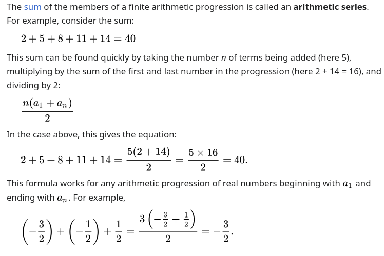

# Arithmetic sequence

useful to determine the iteration in nested loops


example: 

Problem:
Given an array of size n, write a function to count the number of pairs (i, j) where 0 ≤ i < j < n, and the difference between the elements at those indices, i.e., arr[j] - arr[i], equals a given integer d.

Now, imagine you are given a variation:
Suppose you're given an integer n. You are asked:
"How many total times will the inner statement execute in the code below?"
```
for i in range(n):
    for j in range(i + 1):
        # some operation
```
Solution Explanation (using Arithmetic Sequence):

The inner statement executes once for each j in [0, i] for every i in [0, n-1].

    For i = 0, 1 time
    For i = 1, 2 times
    For i = 2, 3 times
    ...
    For i = n-1, n times

So, the total number of executions is the sum:
1 + 2 + 3 + ... + n
This is an arithmetic sequence with first term = 1, last term = n, and difference = 1.

The sum of this sequence is:
total = n * (n + 1) / 2
